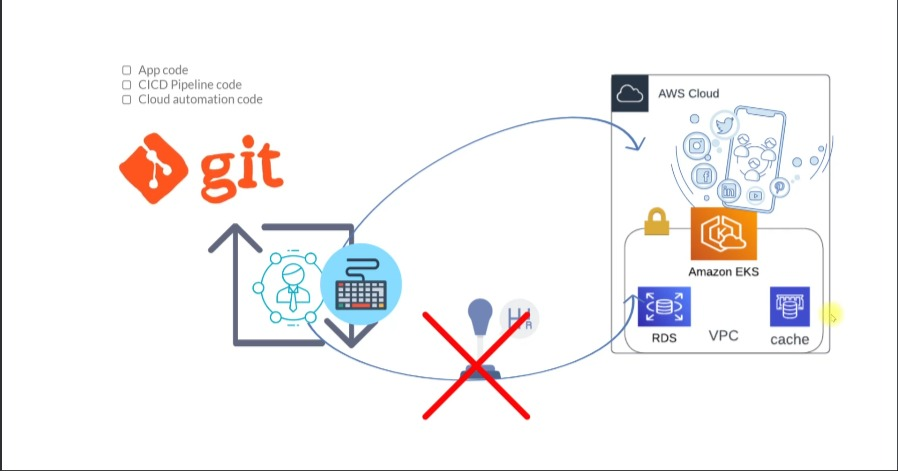
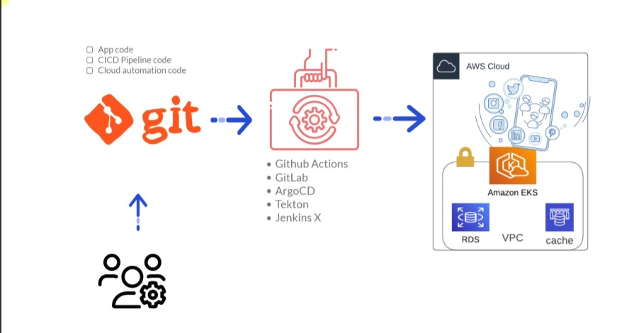
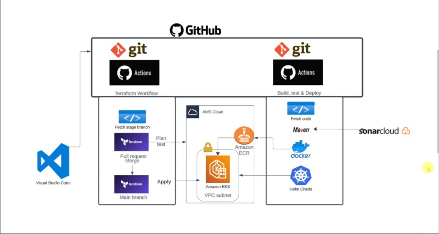
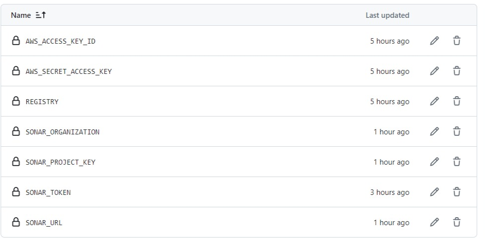
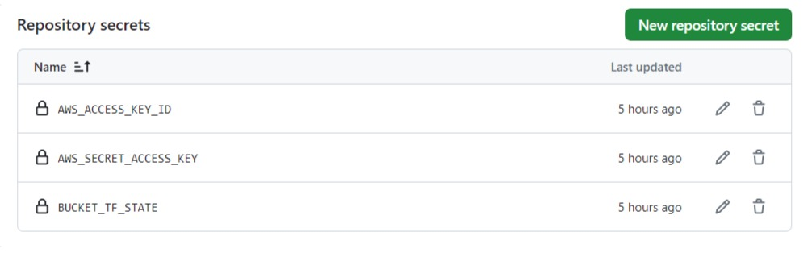
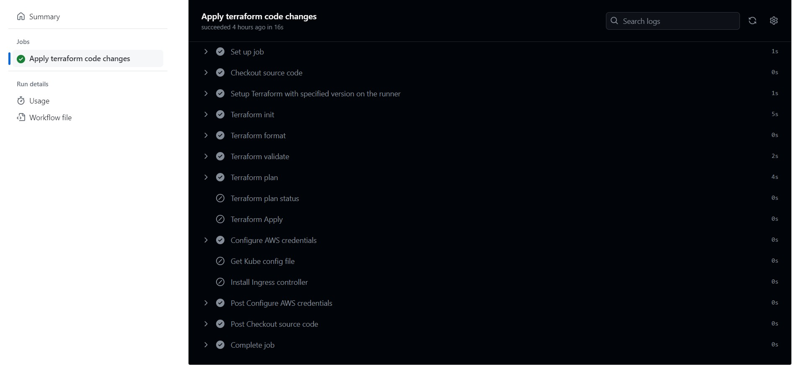
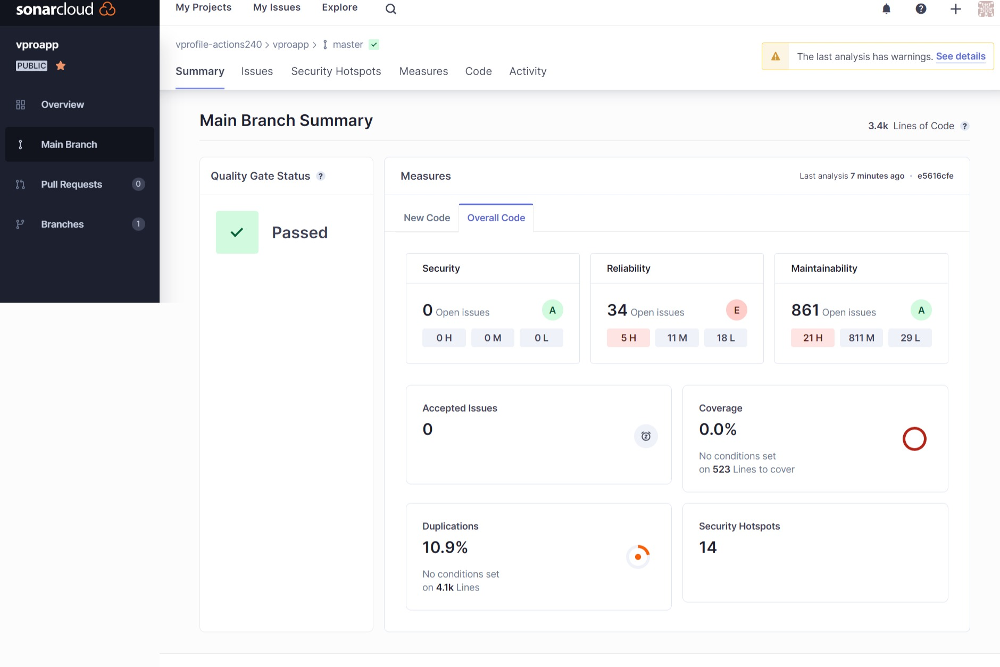
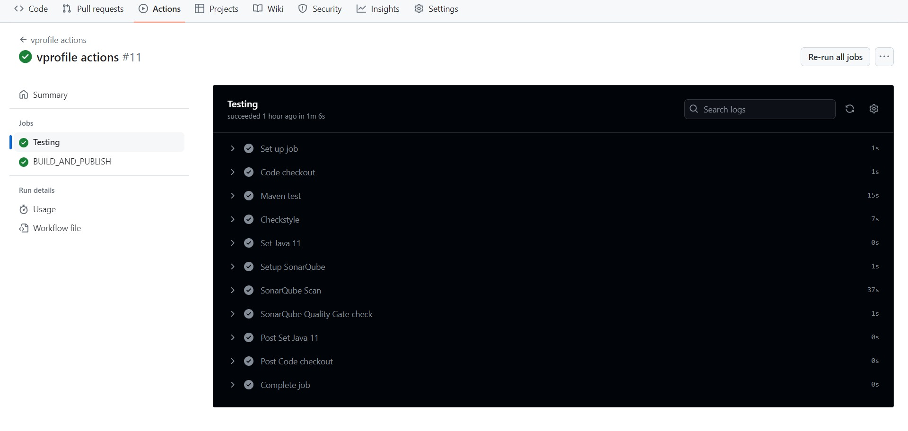
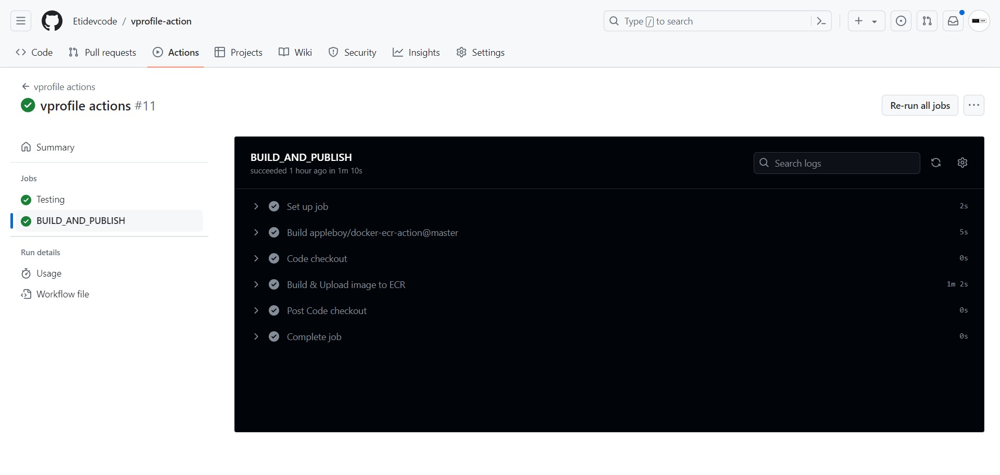

# Projet GitOps

|Projet|
|------|
|Présentation de GitOps|
|Architecture du projet|
|Préparer le dépôt Github|
|Les secrets de GitHub|
|Code Terraform|
|Workflow de préparation pour le code Terraform|
|Flux de travail principal pour le code Terraform|
|Workflow pour le code de l'application Vprofile|
|Docker Construire et publier|
|Déployer sur EKS|
|Nettoyer|

 

## Presentation GitOps

GitOps : Tout dans le code et Git pour le code

Modifications uniquement depuis git

## 1) Problèmes d'automatisation

+ Automatisation et aussi manuel
+ Dérive des infrastructures
+ Aucun historique des modifications
+ Complexité des microservices
+ Pas de versionnage des modifications d'infra

**GitOps**

+ Code
     + Code d'automatisation CICD
     + Code d'automatisation infrarouge

+ Git
     + Versioning de toutes les modifications
     + Suivi du code d'automatisation à un seul endroit
     + Restriction d'accès des utilisateurs à git uniquement

+ Outils

     + Outil de lecture des modifications dans git
     + Appliquer les différences

 

+ Service Elastic Kubernetes (Amazon EKS) : Plan de contrôle Kubernetes entièrement géré
     + Amazon EKS est un service géré qui vous permet d'utiliser facilement Kubernetes sur AWS sans devoir installer ni exploiter votre propre plan de contrôle Kubernetes.

+ Amazon S3
     + Stockez et récupérez n'importe quelle quantité de données, n'importe où
     + Amazon S3 est un service de stockage d'objet offrant une capacité de mise à l'échelle, une disponibilité des données, une sécurité et des performances de pointe.

+ VPC Amazon 
     + Vous permet d'utiliser vos propres ressources isolées au sein du Cloud AWS, puis de connecter ces ressources directement à votre propre centre de données à l'aide de connexions VPN IPsec chiffrées conformes aux normes industrielles.

+ Amazon Elastic Container Registry
     + Partager et déployer des logiciels de conteneur, de manière publique ou privée
     + Amazon Elastic Container Registry (ECR) est un registre de conteneurs entièrement géré qui de stocker, gérer, partager et déployer facilement les images et artefacts de vos conteneurs n'importe où.

+ SonarCloud est une plateforme d'analyse statique du code en continu proposée en tant que service cloud par SonarSource. Elle permet d'inspecter automatiquement le code source des applications pour détecter les erreurs, les bugs, les vulnérabilités de sécurité, ainsi que les problèmes de qualité et de performance.

## Projet Architecture

## Préparer le dépôt Github

[Preparation Dépôt](Commandes/Git_Commands.txt)

## Les secrets de GitHub

+ vprofile-action

+ iac-vprofile & main-iac

## Terraform

[Terraform Main](Terraform_Material/TerraformMainWorkflow.rtf)

[Terraform Staging](Terraform_Material/TerraformStagingWorkflow.rtf)

[Terraform Workflow](Terraform_Material/WorkflowTestCode.rtf)

## Workflow de préparation pour le code Terraform

## Workflow pour le code de l'application Vprofile

## Docker Construire et publier

